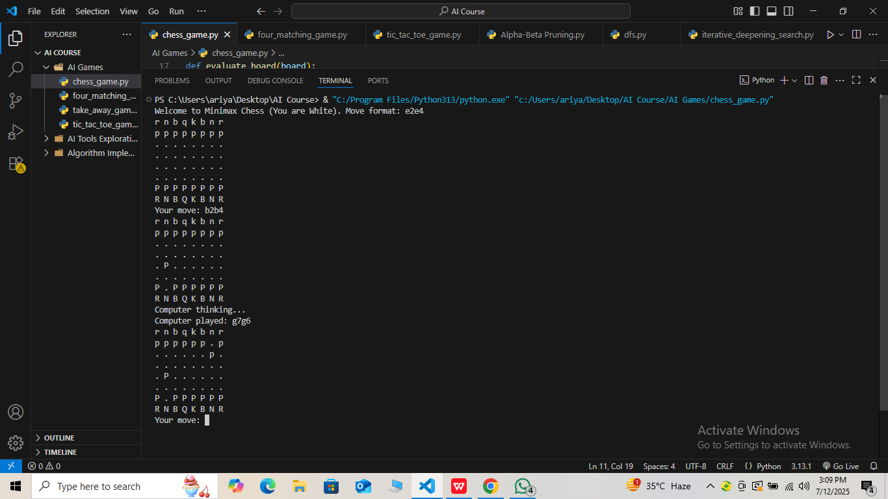

# Chess Game (Player vs AI)

This is a Python command-line Chess game where you (White) compete against an AI (Black). The AI uses the **Minimax algorithm with Alpha-Beta Pruning** to decide its moves. The game is implemented using the `python-chess` library.

---

## Requirements

- Python 3.x  
- Install required library: python-chess

** To install the python-chess library, run this command in your terminal or command prompt:** 

pip install python-chess

---

## How to Run
- Open your terminal or command prompt.

- Navigate to the folder containing the chess game script:

    cd chess_game

- Run the Python script:

    python chess_game.py

---

## How to Play

* You play as White, AI plays as Black.  
* Enter moves in standard UCI format (e.g., `e2e4` to move pawn from e2 to e4).  
* The board is displayed after each move.  
* The game ends when checkmate, stalemate, or draw conditions occur.

---

## Algorithm Used

**Minimax Algorithm with Alpha-Beta Pruning**  
The AI explores possible moves recursively up to a set depth, evaluating board states using a simple piece-value heuristic. Alpha-beta pruning reduces the search space by eliminating moves that won't improve the outcome, optimizing performance.

---

## Screenshot

