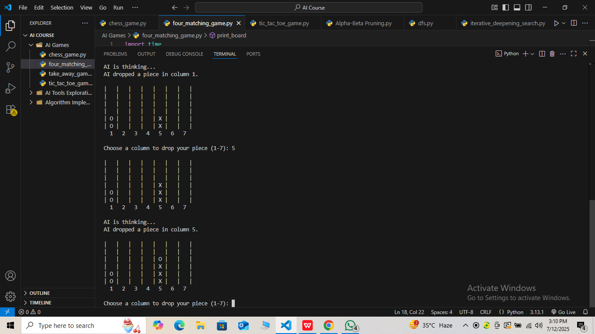

# Four Matching Game (Player vs AI)

This is a terminal-based Four Matching game where you (Player 'X') compete against an AI ('O'). The AI uses the **Minimax algorithm with Alpha-Beta Pruning** to choose the best moves.

---

## Requirements

- Python 3.x  
- No external libraries required

---

## How to Run

1. Open terminal or command prompt.  
2. Navigate to the folder containing this script:

     cd four_matching_game
     python four_matching_game.py

---

## How to Play

- You play as 'X', AI plays as 'O'.  
- Input a column number between 1 and 7 to drop your piece in that column.  
- The goal is to connect four of your pieces vertically, horizontally, or diagonally before the AI does.  
- The board is displayed after every move.

---

## Algorithm Used

**Minimax Algorithm with Alpha-Beta Pruning**  
The AI uses the Minimax algorithm to explore possible moves and choose the best one by simulating future game states. Alpha-Beta pruning optimizes this process by eliminating moves that won’t affect the final decision, improving efficiency.

---

## Screenshot

---
