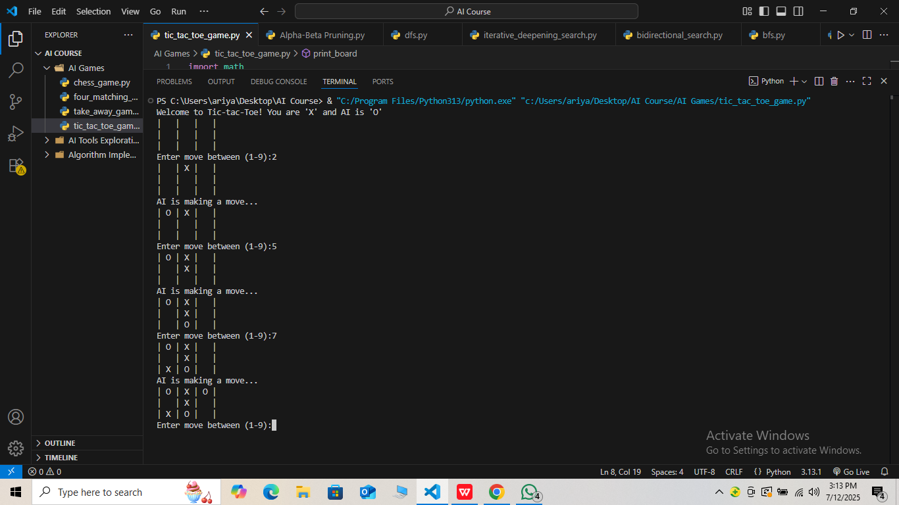

#  Tic Tac Toe (Player vs AI)

This is a Python terminal-based Tic Tac Toe game where you (Player 'X') compete against an AI ('O'). The AI uses the **Minimax algorithm** to choose optimal moves and play perfectly.

---

##  Requirements  

- Python 3.x  
- No external libraries required

---

##  How to Run  

- Open terminal or command prompt.  
- Navigate to the folder containing this script:

     cd tic_tac_toe_game
     python tic_tac_toe_game.py


## How to Play

* You play as 'X' and AI plays as 'O'.

* Input a number between 1 and 9 to place your 'X' in the corresponding cell:

```
    1 | 2 | 3
    4 | 5 | 6
    7 | 8 | 9

```

* The goal is to get three of your marks in a row — horizontally, vertically, or diagonally.

* The AI will make moves automatically after yours.


## Algorithm Used

** Minimax Algorithm **
The AI uses the Minimax algorithm, a recursive decision-making process that explores all possible moves and counter-moves to choose the optimal move that maximizes the AI’s chances of winning while minimizing the player’s chances.

## Screenshot

---




---
